<picture>
    <source media="(prefers-color-scheme: dark)" srcset="images/microchip_logo_white_red.png">
  <source media="(prefers-color-scheme: light)" srcset="images/microchip_logo_black_red.png">
    
</picture> 

# MATLAB/Simulink Model for I2C Peripheral Example: Roll, Pitch and Yaw Angles Estimation using Curiosity Platform Development Board, dsPIC33AK128MC106 Curiosity GP DIM and MPU9250

## 1. INTRODUCTION

This document describes the setup requirements for demonstration of I2C communication on the hardware platform 
[EV74H48A](https://www.microchip.com/en-us/development-tool/EV74H48A) "Curiosity Platform Development Board" and [EV02G02A](https://www.microchip.com/en-us/development-tool/EV02G02A) "dsPIC33AK128MC106 General Purpose Dual In-Line Module (DIM)" using MPU9250 sensor on the MPU 9DOF Click Board.

MPU-9250 is a multi-chip module (MCM) with 9-axis MotionTracking device that combines a 3-axis gyroscope, 3-axis accelerometer, 3-axis magnetometer and a Digital Motion Processor™ (DMP). This example uses all the three sensors to estimate the roll, pitch and yaw angles.

## 2. SUGGESTED DEMONSTRATION REQUIREMENTS

### 2.1 MATLAB Model Required for the Demonstration

To clone or download this MATLAB model on GitHub, 

- MATLAB model can be cloned or downloaded as zip file from the Github repository ([link](https://github.com/microchip-pic-avr-solutions/matlab-dspic33a-curiosity-i2cexample-mpu9250)).

### 2.2 Software Tools Used for Testing the MATLAB/Simulink Model

- MPLAB® X IDE **v6.25** 
- MPLAB® XC-DSC Compiler **v3.21**
-	MATLAB R2025b
-	Required MATLAB add-on packages
    -	Simulink (v25.2)
    -	Simulink Coder (v25.2)
    -	MATLAB Coder (v25.2)
    -	Embedded Coder (v25.2)
    -	MPLAB Device blocks for Simulink (v3.62)
    - Motor Control Blockset (v25.2) 
       
> **_NOTE:_**
>The software tools used for testing the model during release is listed above. It is recommended to use the version listed above or later versions for building the model.

  ### 2.3 Hardware Tools Required for the Demonstration

- Curiosity Platform Development Board [(EV74H48A)](https://www.microchip.com/en-us/development-tool/EV74H48A)
- dsPIC33AK128MC106 General Purpose Dual In-Line Module [(EV02G02A)](https://www.microchip.com/en-us/development-tool/EV02G02A)
- [MPU 9DOF CLICK](https://www.mikroe.com/mpu-9dof-click)

## 3. HARDWARE SETUP
This section describes the hardware setup required for the demonstration.
> **Note:**  
>In this document, hereinafter Curiosity Platform Development Board is referred as **development board**.

1. Insert the **dsPIC33AK128MC106 Curiosity GP DIM** into the DIM Interface **connector J1** on the development board. Make sure the DIM is placed correctly and oriented before going ahead.

     

     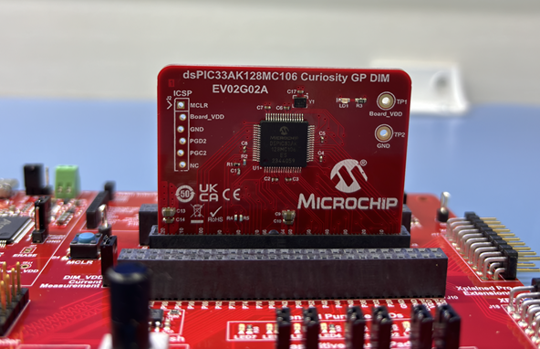

2. Insert the **MPU 9DOF click** into the **mikro BUS A** interface **connector J13** on the development board. Make sure the click board is inserted correctly before going ahead.

     

     

3. The development board has an onboard programmer **PICkit™ On Board (PKoBv4)** , which can be used for programming or debugging the microcontroller or dsPIC DSC on the DIM. To use the onboard programmer, connect a micro-USB cable between the Host PC and **connector J24** on the development board.

    The development board is also powered by this USB itself.

      

     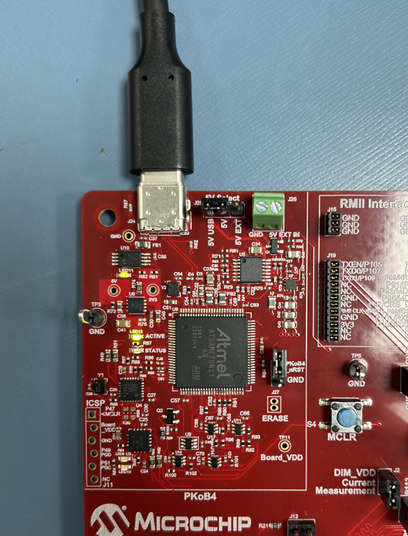

## 4. BASIC DEMONSTRATION

 Follow the below instructions step-by-step, to set up and I2C demo application:

1. Launch MATLAB (refer the section [“2.2 Software Tools Used for Testing the MATLAB/Simulink Model"](#22-software-tools-used-for-testing-the-matlabsimulink-model)).
 

2. Open the folder downloaded from the repository, in which MATLAB files are saved (refer the section ["2.1 MATLAB Model Required for the Demonstration"](#21-matlab-model-required-for-the-demonstration)).

    

    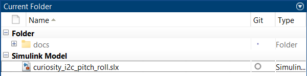

3.	Double click on the I2C example Simulink model - **curiosity_i2c_pitch_roll_yaw.slx**. This opens the Simulink model as shown below.

    

      

    

    > **Note:**  
    >This example demonstrates only the code generation to demostrate the I2C communication. The simulation is not possible in this case.

4.	
From this Simulink model an MPLAB X project can be generated, and it can be used to run the I2C Communication using development board. 
To generate the code from the Simulink model, go to the <b>"MICROCHIP"</b> tab, and enable the tabs shown in the figure below. 

    

      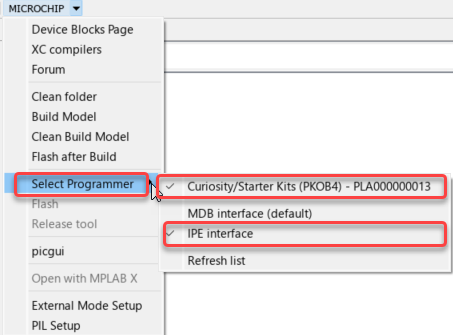

    

5. 
	This model uses the <b>External Mode</b> debug option for real time data visualization. To configure the external mode click on <b>"Ext Mode Settings" </b> option under the <b>“Microchip”</b> tab. 
  This will open <b>External Mode Setup</b> window and enable the checkboxes as shown in the figure. Also select the <b> COM port </b> connected to the development board  and <b>Baud Rate</b>.

    

      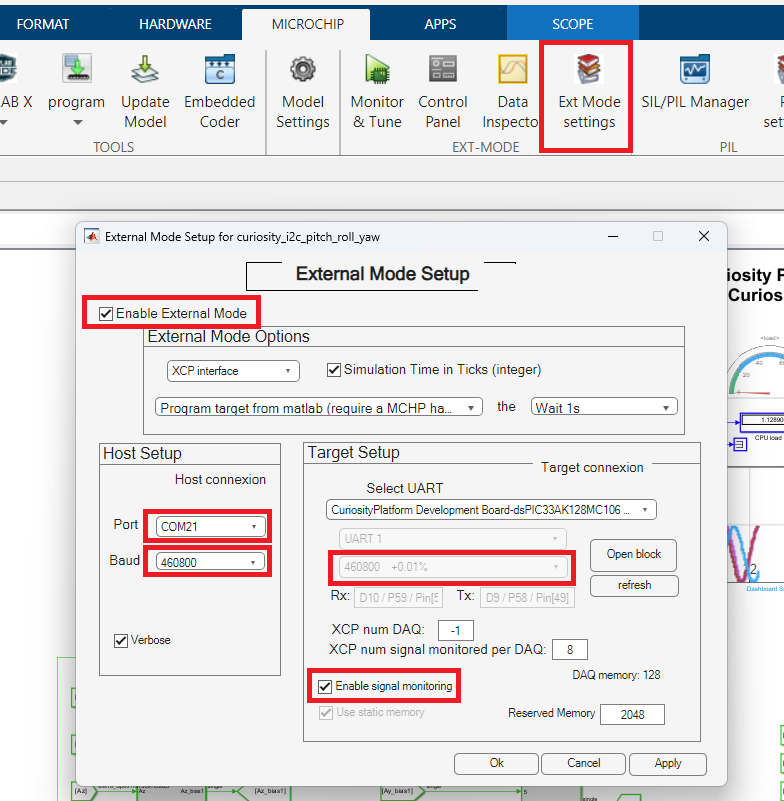

    

    > **Note:**  
    >Two COM ports are available on the development board. Select the second COM port number for the external mode (if COM2 and COM3 are available on the development board, select COM3).

6.	
	To generate the code and run the I2C communication on hardware, click on <b>"Monitor & Tune" </b> option under the <b>Hardware</b> tab and ensure that <b>"Stop Time" </b> is set to <b>"inf"</b>. 

    

      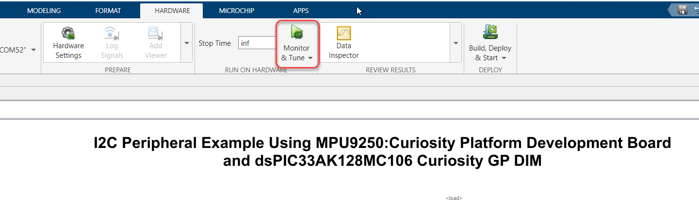

    

7.	
 After compilation and programming the device. The external mode will be running on the dsPIC.

    

      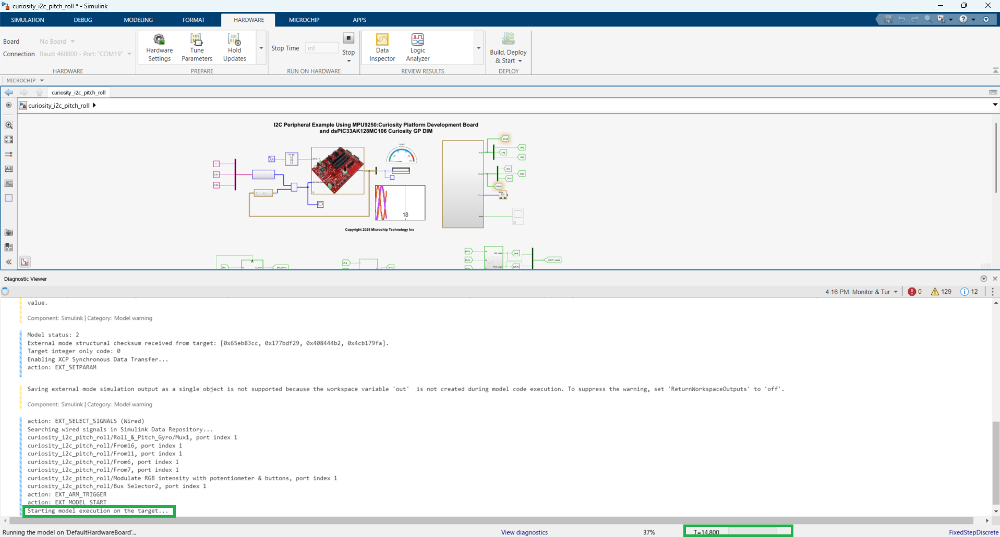

    

 The <b>General Purpose LED's</b> will be blinking.

    

      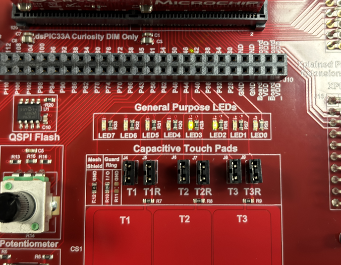

    

8. 
	The <b> RGB LEB</b> will be glowing in different colors. To increase the brightness of the RGB LED, vary the <b>Potentiometer</b> on the development board.

    

      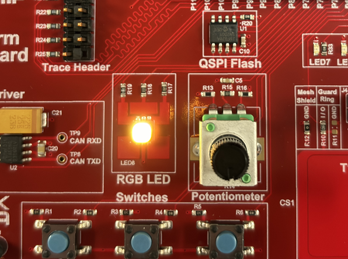

    

9. 
	To view the estimated roll, ptch and yaw angles from the <b>accelerometer, gyroscope and magnetometer sensors of MPU9250</b> double click on the scope. This opens the scope view. Tilt or turn the development board by hand to view variations in the roll, pitch and yaw angles.

    

      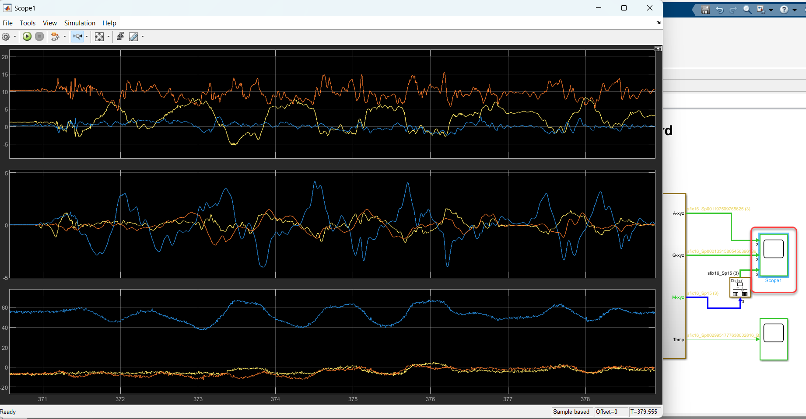

    

10. 
Click on the <b>Stop</b> button to stop the I2C communication and external mode.

    

      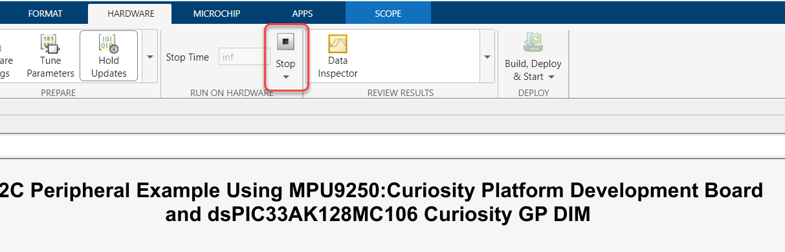

    

> **Note:**  
>Ensure that at startup, the **development board** and **MPU9250** remain static and level for about 2 seconds for calibration. After calibration, the board can be tilted or rotated to observe angle variations.

## 	REFERENCES:
For more information, refer to the following documents or links.
1. Curiosity Platform Development Board User's Guide [(DS70005562)](https://ww1.microchip.com/downloads/aemDocuments/documents/MCU16/ProductDocuments/UserGuides/Curiosity-Platform-Development-Board-Users-Guide-DS70005562.pdf)
2. dsPIC33AK128MC106 General Purpose Dual In-Line Module (DIM) Information Sheet [(DS70005556)](https://ww1.microchip.com/downloads/aemDocuments/documents/MCU16/ProductDocuments/InformationSheet/dsPIC33AK128MC106-General-Purpose-DIM-Info-Sheet-DS70005556.pdf)
3. dsPIC33AK128MC106 Family datasheet [(DS70005539)](https://ww1.microchip.com/downloads/aemDocuments/documents/MCU16/ProductDocuments/DataSheets/dsPIC33AK128MC106-Family-Data-Sheet-DS70005539.pdf)
4. MPLAB® X IDE User’s Guide [(DS50002027)](https://ww1.microchip.com/downloads/en/DeviceDoc/50002027E.pdf) or [MPLAB® X IDE help](https://microchipdeveloper.com/xwiki/bin/view/software-tools/x/)
5. [MPLAB® X IDE installation](http://microchipdeveloper.com/mplabx:installation)
6. [MPLAB® XC-DSC Compiler installation](https://developerhelp.microchip.com/xwiki/bin/view/software-tools/xc-dsc/install/)
7.  [MPLAB Device Blocks for Simulink :dsPIC, PIC32 and SAM mcu](https://in.mathworks.com/matlabcentral/fileexchange/71892-mplab-device-blocks-for-simulink-dspic-pic32-and-sam-mcu)
8. [External Mode Demo](https://www.microchip.com/en-us/about/media-center/videos/wuzLmORk1M0)